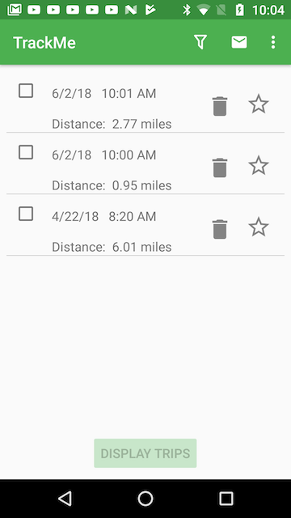

# Udacity CapstoneProject (*TrackMe*)
*TrackMe* is my final project for [Udacity's Android Developer Nanodegree Program](https://www.udacity.com/course/android-developer-nanodegree-by-google--nd801 ).

*TrackMe* provides trip tracking which when activated tracks and records the user's movement. Trip tracking can be used to
help track vehicle usage, file trip expense reports, or compare differences in daily routes that are frequented by the user.

## User Notes
*TrackMe* provides two principal features, a trip log to display information about trips that have been saved and a trip tracker for capturing new trip data. Trip tracking is initated using the "New Trip" menu item or using the app widget that is installed with the app. After the user grants for the app to use location services the app's top level view is the trip log screen (phone version) shown here:

The Trip Log is a list of previously recorded trips. The trip log can be filtered by date range or to only include trips that have been marked as favorites. The trip log can also be sorted by trip date or trip distance using the Sort menu time.  Trips can be deleted using the trash can or favored using the Star icon.

Up to four trips can be selected for viewing on a map and to obtain additonal trip details. Check the boxes on the left corresponding to the trips to view and select the "Display Trips" button on the bottom of the screen. A plot of the trips is then shown:

